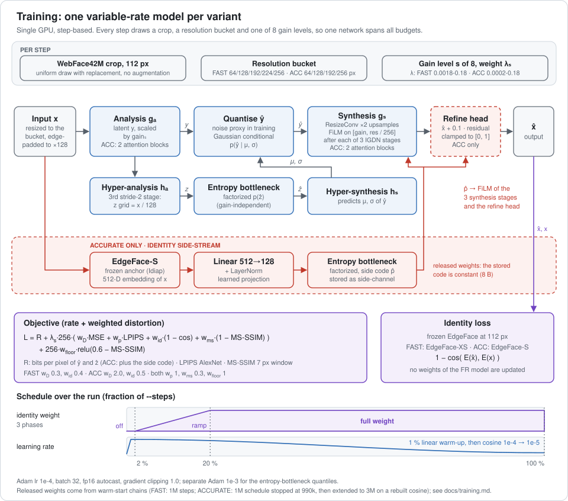
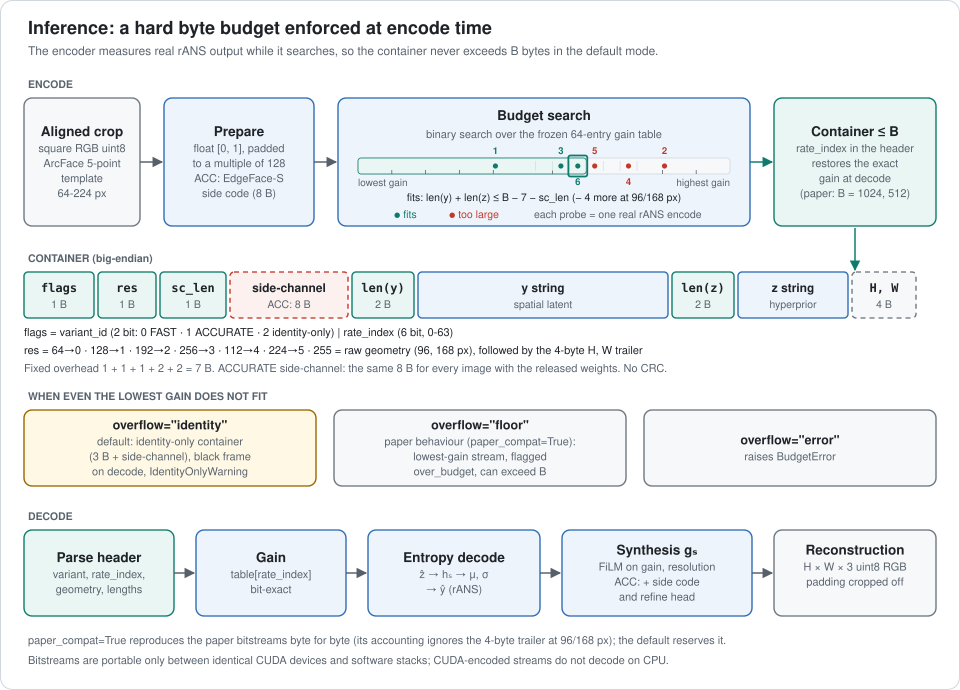

# face1kb: identity-preserving face compression under 1 kB

**Two learned face codecs that fit an aligned face crop into at most 1024 (or 512)
bytes and keep it verifiable by face recognition, together with the complete benchmark
of the extended study.**

[](https://arxiv.org/abs/2608.22866)
[](#ijcb-2026-version)
[](LICENSE)
[](weights/LICENSE)

This repository accompanies **"Toward Sub-1 kB Identity-Preserving Face Compression"**
(Petr Hurtik, Jakub Sochor; [arXiv:2608.22866](https://arxiv.org/abs/2608.22866)).
It releases:

- **face1kb-FAST** and **face1kb-ACCURATE**, called *Ours-FAST* and *Ours-ACCURATE* in
  the paper and in the result files. They are variable-rate learned codecs with a
  **hard byte budget**: in the default mode `len(codec.encode(img, budget)) <= budget`
  holds for every image. The weights are in [`weights/`](weights/README.md).
- The code that reproduces every section of the paper: the benchmark of ten baseline
  codecs on 14 public face-recognition models, image quality, speed, fairness,
  recompression, preprocessing, resolution, sample difficulty, adversarial
  sanitization, the ISO/IEC 29794-5 annex study and significance tests.
- The aggregate results behind the paper's tables and figures
  ([`results/`](results/README.md)). The paper's data tables can be rebuilt from them
  on a CPU, without any data.

The study targets face images stored in 2D barcodes, such as a signed QR code on a
boarding pass or a travel credential, where the face must fit into about one kilobyte:

<p align="center">
  
</p>

The earlier conference version, **"Face Recognition at One Kilobyte"** (IJCB 2026),
remains available under the git tag [`ijcb2026`](#ijcb-2026-version).

## The two codecs

Both codecs extend CompressAI's variable-rate mean-scale hyperprior. A third
hyper-downsample shrinks the hyperprior byte floor, and the synthesis uses ResizeConv
upsampling with FiLM conditioning on gain and resolution. One model per variant covers
all rates. **ACCURATE** is wider, adds attention, and adds an identity side-stream
computed from a frozen EdgeFace-S model together with a refinement head. **FAST** runs
no face-recognition model at inference time.

<p align="center">
  <picture>
    <source media="(prefers-color-scheme: dark)" srcset="assets/training_dark.svg">
    
  </picture>
</p>

At encode time, a binary search over a frozen 64-entry gain table measures the **real**
rANS output until it finds the largest gain that fits. The result is packed into a
self-describing container with 7 bytes of fixed overhead:

<p align="center">
  <picture>
    <source media="(prefers-color-scheme: dark)" srcset="assets/inference_dark.svg">
    
  </picture>
</p>

| | face1kb-FAST | face1kb-ACCURATE |
|---|---|---|
| Name in the paper | Ours-FAST | Ours-ACCURATE |
| Parameters | 1,352,021 (1.35 M) | 18,712,400 (18.7 M), of which 3,652,520 are the frozen EdgeFace-S anchor |
| Weight file | 5.4 MB | 74.9 MB |
| Channels N / M / N<sub>z</sub>, attention | 64 / 96 / 48, none | 192 / 320 / 64, 2 + 2 blocks |
| Face-recognition model at inference | none | EdgeFace-S inside the encoder |
| Encode, including the rate search, RTX 2080 Ti | 129-148 ms | 343-412 ms |
| Decode, RTX 2080 Ti | 22-28 ms | 34-46 ms |
| Training | 1M steps | 3M steps |

Times are medians per crop over all five resolutions and both budgets, with a warm
entropy-coder cache ([docs/codec.md](docs/codec.md#performance)). Table `tab:speed` in
the paper times a single encode at the budget-fitting gain, without the search: at
112 px / 1024 B on the GPU, FAST takes 22.4 ms to encode and 22.9 ms to decode, and
ACCURATE takes 54.0 ms and 63.1 ms.

**Headline results** at the 112 px working resolution, quoted from the arXiv tables
(table labels in brackets). WebP is the best classical codec in every column of these
tables. The best value of each row is in bold.

| Metric (paper table) | Dataset, budget | Ours-ACCURATE | Ours-FAST | JPEG-AI | WebP |
|---|---|---:|---:|---:|---:|
| FNMR (%) at FMR = 10<sup>-4</sup>, mean of ArcFace and LVFace-L, lower is better (`tab:frr-summary`) | Color FERET, 1024 B | 1.26 | 3.82 | **1.00** | 1.06 |
| | Color FERET, 512 B | **1.83** | 6.65 | 2.86 | 6.01 |
| | AI-Solutions-KK, 1024 B | 2.93 | 10.55 | **2.92** | 3.98 |
| | AI-Solutions-KK, 512 B | **6.93** | 24.30 | 9.64 | 24.28 |
| EER (%) on the held-out CVLface IR-101 matcher, lower is better (`tab:heldout-cvlface`) | Color FERET, 1024 B | 0.05 | 0.15 | 0.03 | **0.03** |
| | Color FERET, 512 B | **0.08** | 0.32 | 0.13 | 0.23 |
| | AI-Solutions-KK, 1024 B | **0.51** | 1.21 | 0.52 | 0.66 |
| | AI-Solutions-KK, 512 B | **0.92** | 2.40 | 1.25 | 2.55 |
| Worst-5 % identity cosine (ArcFace p5), higher is better (`tab:idcos-tail`) | Color FERET, 512 B | **0.802** | 0.636 | 0.742 | 0.597 |
| | AI-Solutions-KK, 512 B | **0.763** | 0.591 | 0.680 | 0.581 |

At 1024 B, JPEG-AI and ACCURATE are close. At 512 B, ACCURATE is the most robust
codec on these public matchers. At the 224 px source resolution, JPEG-AI is above
Ours-ACCURATE in median identity cosine in all four dataset/budget cells
(`tab:codec-results`; measured with a proprietary matcher on 64 crops per cell, so the
public code cannot regenerate these values). The paper also reports other matchers,
resolutions and metrics.

**What to know before using the codecs** (details in
[docs/codec.md](docs/codec.md#limitations)):

- **Budget guarantee.** In the default mode the container never exceeds the budget.
  If even the lowest gain does not fit, the encoder emits a tiny identity-only
  container that decodes to a black frame, and issues an `IdentityOnlyWarning`. This
  happens for FAST at 168 and 224 px with 512 B on many in-the-wild faces, and never
  at 64 or 112 px. `paper_compat=True` reproduces the paper bitstreams byte for byte.
  That includes the paper's budget accounting, which ignores the 4-byte geometry
  trailer at 96 and 168 px.
- **The ACCURATE identity side-channel is a constant 8 bytes in practice.** With the
  released weights, the projection of the side-stream has collapsed. The stored code
  is the same 8 bytes for every image, so it acts as a fixed learned conditioning of
  the decoder. The paper text describes it as about 90-175 B
  ([docs/errata.md](docs/errata.md)).
- **Bitstreams are device-specific.** The entropy-coder tables are rebuilt at run
  time. Streams are portable only between CUDA devices with the same software stack,
  and CUDA-encoded streams do not decode on a CPU. Byte-exactness was verified on an
  RTX 2080 Ti with torch 2.10.0 / CUDA 12.8, compressai 1.2.8 and timm 1.0.24.
- **Inputs** are square RGB crops aligned to the ArcFace five-point template. The
  codecs were trained at 64-256 px and evaluated at 64-224 px.
- **Privacy.** A container encodes the face itself. Protect it like any face image.

## Quick start

```bash
git clone https://github.com/innovatrics/1kb_face_ijcb.git
cd 1kb_face_ijcb
git lfs install && git lfs pull   # fetch the weights; without this, weights/*.safetensors are pointer files
pip install -e .                  # the codecs: torch < 2.11, compressai 1.2.8, timm 1.0.24
```

`scripts/setup_env.sh` creates a virtual environment with all extras. `--paper`
installs the exact package versions of the paper (`requirements/paper.txt`), and
`--core` installs only the codecs.

```python
import numpy as np, face1kb
from PIL import Image
img = np.asarray(Image.open("face_112.png").convert("RGB"))  # aligned square crop, uint8
codec = face1kb.load("accurate", device="cuda")               # or "fast"
data = codec.encode(img, budget=1024)                         # bytes, len(data) <= 1024
img_hat = codec.decode(data)                                  # 112 x 112 x 3 uint8
```

`codec.encode(img, budget, return_info=True)` also returns the chosen rate index, the
gain and the fit flags. `face1kb.decode(data)` decodes any container and reads the
variant from its header.

On the command line (also installed as `face1kb-codec`):

```bash
python -m face1kb.codec encode face.png --variant fast --budget 512   # -> face.f1k, prints a JSON record
python -m face1kb.codec info face.f1k                                # header fields, no decoding
python -m face1kb.codec decode face.f1k                              # -> face_decoded.png
```

To train a codec on your own aligned crops, see [docs/training.md](docs/training.md).
Training needs the `train` extra and one GPU.

## What's inside

```text
face1kb/                  Python package (MIT)
  codec/                  face1kb-FAST / -ACCURATE: networks, budget search, container, API, CLI, trainer
  baselines/              the ten baseline codecs (JPEG, JPEG 2000, WebP, JPEG XL, AVIF, HEIF,
                          JPEG-FzT, JPEG-AI, bmshj2018, mbt2018), budget search, unified decoder
  fr/                     the 14 public face-recognition evaluators (pinned, fetched on demand)
                          and hooks for your own matcher (register_onnx / register_torch)
  data/                   index and pair builders, Color FERET NIST label parser, alignment
                          template, crop variants, preprocessing operators, attributes
  eval/                   verification (EER, FNMR at FMR, bootstrap CIs), significance,
                          fairness, image-quality metrics
  adversarial/            HFC, CLIP and Li-AE attacks, Li-AE proxy, sanitization metric
  report/                 LaTeX table and matplotlib helpers
  third_party/edgeface/   vendored EdgeFace backbone code (BSD-3-Clause)
experiments/              one folder per paper area; each has a run.sh for the full-scale run
  prepare/                     Sec. 3       datasets: index, pairs, labels, attributes, crop variants
  compress/, speed/            Sec. 2, 4-6  compressed grid, budget compliance, codec properties, speed
  embed/, accuracy/            Sec. 5, 7, 14  embeddings, EER/FNMR grid, held-out matcher, significance
  quality/                     Sec. 6       PSNR/SSIM/MS-SSIM/LPIPS/DISTS, face image quality, montages
  codec_comparison/            Sec. 5-7     rate-identity comparison, JPEG-AI operation points
  difficulty/                  Sec. 8       trivial and difficult samples
  resolution/, preprocessing/  Sec. 9       resolution trade-off, preprocessing, crop tightness
  annex/                       Sec. 10      ISO/IEC 29794-5 Annex E/F study
  fairness/                    Sec. 11      subgroup EER, disparity, differential FMR, CIs
  recompression/               Sec. 12      compressed-on-compressed chains
  adversarial/                 Sec. 13      attack crafting and sanitization
  figures/                     summary figures, collection of results/
results/                  aggregate paper results (CSV/JSON; no images, no per-image data)
weights/                  released weights (git LFS), model card, CC BY-NC-SA 4.0 licence
docs/                     documentation, see docs/README.md
scripts/                  setup_env.sh, setup_jpegai.sh (JPEG-AI reference software), fetch_models.py
third_party/              jpeg-ai.patch, applied by setup_jpegai.sh
tests/                    unit tests (CPU); GPU and data tests are marked and skip without them
```

## Reproducing the paper

[docs/reproduce.md](docs/reproduce.md) maps every section, table and figure of the
paper to its commands and inputs. It also gives the GPU cost and says whether an item
renders from the shipped `results/` or needs the datasets. In short:

- **Without any data:** every data table of the paper except Table 4 (which needs the
  NIST labels) and 24 of its figures render on a CPU from `results/`, for example with
  `FROM_RESULTS=1 PAPER_HEADER=1 SKIP="1 2 3" bash experiments/accuracy/run.sh` and
  `python experiments/figures/render_figures.py --from-results`. With the paper
  environment most outputs are byte-identical to the arXiv sources. The few that are
  not are listed in [docs/errata.md](docs/errata.md).
- **Full reproduction** starts from aligned crops (see [Datasets](#datasets)) and runs
  the `experiments/*/run.sh` scripts in order: prepare, compress, embed, accuracy, then
  the other areas. The full grid takes several hundred GPU-hours, most of them for
  JPEG-AI.
- Where the text of the arXiv report differs from the code, the code is the
  reference. Every confirmed difference is listed in the
  [errata of arXiv:2608.22866 v1](docs/errata.md) (they concern the arXiv report,
  not the IJCB paper, and will be fixed in its next version). For
  example, the identity cosines of some tables were measured with a proprietary
  matcher, and the public code cannot regenerate them.

## Datasets

No dataset is redistributed here. The public pipeline starts from **aligned face
crops**: square crops warped onto the ArcFace five-point template at 64, 96, 112, 168
and 224 px ([docs/datasets.md](docs/datasets.md)).

- **AI-Solutions-KK**: the raw photographs (105 identities, 17,534 images) are the
  public, MIT-licensed
  [AI-Solutions-KK/face_recognition_dataset](https://huggingface.co/datasets/AI-Solutions-KK/face_recognition_dataset).
  The aligned crops used in the paper are **available on request from the authors**:
  open an issue on this repository ([issues](https://github.com/innovatrics/1kb_face_ijcb/issues)) to ask for them.
- **Color FERET**: obtain it from [NIST](https://www.nist.gov/itl/products-and-services/color-feret-database)
  under the NIST terms. The paper aligned NIST Color FERET to the ArcFace five-point
  template at the resolutions above. `face1kb.data` includes a parser for the NIST
  ground-truth labels, which the fairness study uses. Crops that you align yourself
  give comparable, not identical, numbers.

The repository contains no dataset images, per-image values or embeddings.

## IJCB 2026 version

The code and data release of the conference paper, *Face Recognition at One Kilobyte:
Evaluating Image Compression Algorithms for Barcode-Constrained Biometric Verification*
(Hurtik and Števuliáková, IJCB 2026), is preserved under a git tag:

```bash
git checkout ijcb2026
```

The extended study adds the two face1kb codecs, a larger public matcher roster, more
resolutions and budgets, and the fairness, recompression, adversarial, annex and
difficulty studies.

## Licence

- **Code**: MIT ([LICENSE](LICENSE)). The vendored EdgeFace backbone code in
  `face1kb/third_party/edgeface/` is BSD-3-Clause
  ([licence](face1kb/third_party/edgeface/LICENSE)).
- **Weights** (`weights/`: both codecs and the Li-AE proxy): CC BY-NC-SA 4.0
  ([weights/LICENSE](weights/LICENSE)). The weights are non-commercial because the
  codecs were trained on WebFace42M, which is used for research purposes only.
- **Bundled third-party weights**: `face1kb_accurate.safetensors` contains the frozen
  **EdgeFace-S** model by Anjith George, Christophe Ecabert, Hatef Otroshi Shahreza,
  Ketan Kotwal and Sébastien Marcel (Idiap Research Institute), licensed under
  CC BY-NC-SA 4.0 ([model card](weights/README.md#bundled-third-party-weights-edgeface-s)).
- **Other third-party components are not redistributed.** The JPEG-AI reference
  software, the 14 face-recognition evaluators, the insightface models, CLIP and the
  TopoFR code are fetched from their official sources at setup or run time, pinned by
  commit or SHA-256, and stay under their own licences. Several allow non-commercial
  research use only ([docs/models.md](docs/models.md),
  [docs/baselines.md](docs/baselines.md#licences)).

## Citation

If you use the codecs or the benchmark, please cite the extended study. If you refer
to the conference results, please cite the IJCB paper.

```bibtex
@article{hurtik2026sub1kb,
  title   = {Toward Sub-1 kB Identity-Preserving Face Compression: A Benchmark of Codecs,
             a Custom Learned Codec, and Studies of Resolution, Demographic Fairness,
             Recompression, and Adversarial Robustness},
  author  = {Hurtik, Petr and Sochor, Jakub},
  journal = {arXiv preprint arXiv:2608.22866},
  year    = {2026}
}

@inproceedings{hurtik2026onekilobyte,
  title     = {Face Recognition at One Kilobyte: Evaluating Image Compression Algorithms
               for Barcode-Constrained Biometric Verification},
  author    = {Hurtik, Petr and {\v{S}}tevuli{\'a}kov{\'a}, Petra},
  booktitle = {IEEE International Joint Conference on Biometrics (IJCB)},
  year      = {2026}
}
```
