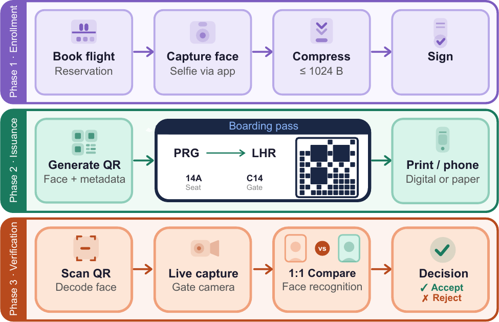
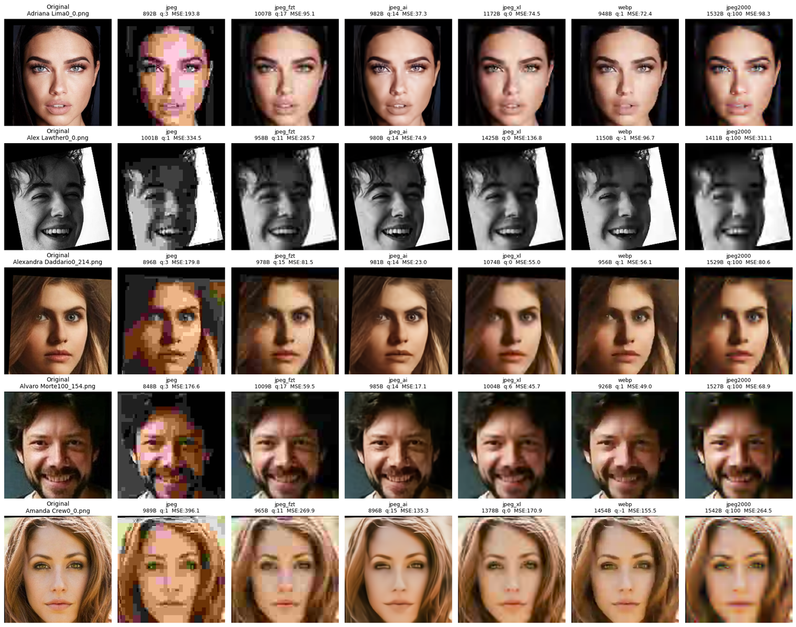

# Face Recognition at One Kilobyte

**Evaluating Image Compression Algorithms for Barcode-Constrained Biometric
Verification**

This repository is the supplementary material for our paper **accepted at
the IEEE International Joint Conference on Biometrics (IJCB) 2026**. It
contains the code needed to replicate the paper's automated evaluation —
data preparation, compression, embedding extraction, metric computation and
statistical tests — and explains how to obtain the aligned dataset
(available on request).

> 📄 **Paper:** arXiv link coming soon.

## Abstract

> Barcode-based biometric credentials, such as ICAO Digital Travel
> Credentials, require facial photographs to be compressed to approximately
> one kilobyte, posing significant challenges for automated face
> recognition. This paper systematically evaluates six lossy compression
> algorithms (JPEG, JPEG2000, JPEG-AI, JPEG-FzT, JPEG-XL, and WebP) on ten
> face recognition models (seven open-source and three proprietary
> configurations) at two resolutions (112×112 and 224×224 pixels). The
> results indicate that JPEG-AI and WebP consistently yield the lowest
> degradation of recognition across models and operating points; on the
> size-compliant subset at 224×224 pixels, JPEG-AI is moreover
> statistically superior to all remaining codecs. JPEG-AI and JPEG-FzT are
> the only algorithms compressing all 224×224 images to the 1 kB target,
> making them uniquely suitable when a strict per-image size guarantee is
> required, whereas JPEG2000 performs poorest. The reported codec ranking
> remains stable across demographic subgroups, acquisition conditions,
> cross-age pairs, compressed-to-compressed matching, and two additional
> state-of-the-art recognition models.

### Key findings

1. **JPEG-AI and WebP form a statistically indistinguishable top tier**,
   with JPEG-AI stronger at the higher resolution and at the stricter FAR
   operating points. On the **size-compliant 224×224 subset** — the 4,524
   images (25.8 %) that all five non-JPEG2000 codecs compress to ≤ 1 kB —
   JPEG-AI is statistically superior to all four other codecs
   (Holm-corrected Wilcoxon tests), including WebP.
2. **JPEG-AI and JPEG-FzT are the only codecs that compress every
   224×224 image within the budget**, which suits deployments with a hard
   per-image size ceiling.
3. **JPEG2000 consistently performs worst** and meets the budget for no
   224×224 image.
4. Perceptual quality metrics (SSIM, LPIPS) correlate only partially with
   biometric utility and should not serve as sole proxies for
   recognition-preserving compression.
5. Human verification accuracy is invariant to codec choice (p = 0.56),
   confining the operational impact of codec selection to the automated
   recognition stage.
6. The codec ranking persists across demographic subgroups, acquisition
   conditions, cross-age pairs, the compressed-to-compressed protocol and
   two additional state-of-the-art models.

The pipeline in this repository covers findings 1–4 — the size-compliant
analysis of finding 1 is `face1kb.metrics.compliant_subset` — subject to
the proprietary-model caveat below; the human study (5) and the robustness
analyses (6) are not part of this code release.

<p align="center">
  <br>
  <em>The studied scenario (Figure 1 of the paper): a facial photograph is
  captured, compressed to ≤ 1 kB and signed at enrollment (Phase 1),
  encoded into a QR code on the boarding pass (Phase 2) and, at the gate,
  decoded and compared against a live capture (Phase 3). This repository
  covers the "Compress", "1:1 Compare" and "Decision" blocks.</em>
</p>

## What is in this repository

```text
face1kb/                      Evaluation pipeline (Python package)
├── config.py                 Central paths & constants (env-overridable)
├── data/                     1) Data preparation
│   ├── download_dataset.py   Fetch aligned crops from HuggingFace (on request)
│   ├── pairs.py              Canonical verification-pair protocol
│   └── define_pairs.py       Pair statistics / optional CSV export
├── compression/              2) Compression to the 1 kB budget
│   ├── codecs.py             Target-size search for all six codecs
│   ├── jpeg_fzt.py           JPEG-FzT codec (F-transform + JPEG)
│   ├── jpeg_ai.py            JPEG-AI reference-software wrapper
│   ├── compress_dataset.py   Compress every image with every codec
│   ├── decode.py             Bitstream → RGB for any codec
│   └── decompress_dataset.py Decode all bitstreams to PNG once
├── embeddings/               3) Face-embedding extraction
│   ├── compute_embeddings.py             7 open-source models (DeepFace)
│   ├── compute_embeddings_proprietary.py 3 proprietary models / mockup
│   └── make_mockup_model.py              Deterministic mockup ONNX per model
└── metrics/                  4) Metrics of the paper
    ├── verification.py       Pair scores, EER, FRR@FAR core
    ├── compute_accuracy.py   Accuracy per model × codec (Fig. 2; per-model FRR averaged in Figs. 4-5)
    ├── compute_image_quality.py  SSIM + LPIPS (Table 5)
    ├── collect_file_sizes.py     Size stats & compliance (Fig. 3)
    ├── measure_speed.py          Codec speed (Table 2)
    ├── compliant_subset.py       Size-compliant subsets (Sec. 3.4)
    └── statistical_tests.py      Friedman, Wilcoxon-Holm, Cliff's δ (Sec. 3.4, Table 3)

tools/build_hf_dataset.py     Script that built the HuggingFace dataset
docs/JPEG_AI.md               How to obtain & configure JPEG-AI
docs/jpeg-ai-compat.patch     Compatibility changes for that checkout
setup_env.sh                  Environment preparation
run_all.sh                    Complete pipeline, end to end
```

## Dataset

The evaluation uses the publicly available, MIT-licensed
[AI-Solutions-KK/face_recognition_dataset](https://huggingface.co/datasets/AI-Solutions-KK/face_recognition_dataset)
(105 identities, 17,534 images). The images were preprocessed with a
proprietary face detector and ArcFace-style five-landmark alignment; since
that step is not reproducible without proprietary tooling, we provide the
**aligned crops** used in the paper as a HuggingFace dataset:

- **Dataset id:** `Cha53c/1kb-face-aligned` — a single split holding both
  crop resolutions (image, identity, file name, resolution); the
  `resolution` column (112 or 224) selects a resolution.
- **Access:** the dataset is private and **available on request** from the
  authors; contact details are in the paper. Access is granted to a
  HuggingFace account.

Once access has been granted, authenticate and download:

```bash
hf auth login        # or export HF_TOKEN=<your token>
                     # (older huggingface_hub: huggingface-cli login)
python -m face1kb.data.download_dataset
```

The script exports the crops to `data/aligned_<resolution>/` and writes the
canonical image list `data/names.csv`. Verification uses all non-redundant
image pairs — 1.52 M mated and 152.2 M non-mated — formed directly from the
identity labels (see `face1kb/data/pairs.py`).

## Getting started

```bash
git clone https://github.com/innovatrics/1kb_face_ijcb.git
cd 1kb_face_ijcb
./setup_env.sh              # venv + Python deps; add --with-jpeg-ai to
                            # also clone the JPEG-AI reference software
source .venv/bin/activate
```

External requirements:

- access to the aligned dataset (on request, see [Dataset](#dataset)) and
  a HuggingFace login,
- `cjxl`/`djxl` for JPEG XL (`sudo apt install libjxl-tools`),
- the JPEG-AI reference software for the `jpeg_ai` codec — **see
  [docs/JPEG_AI.md](docs/JPEG_AI.md)**; without it the pipeline runs with
  the remaining five codecs,
- a CUDA GPU is recommended (JPEG-AI and embedding extraction).

### Run everything

```bash
./run_all.sh
```

Runs the ten stages listed in the script header for both resolutions (the
size-compliant subsets at 224×224 only) and writes all tables to
`outputs/metrics/`. Expect the full run to take on the order of a day on a
single-GPU machine (JPEG-AI encoding and 10 × 7 embedding extractions
dominate). Download, compression, decoding and embedding extraction skip
outputs that already exist (`run_all.sh` passes `--skip-existing`), so an
interrupted run can be restarted; the metric stages recompute their tables
from the stored bitstreams and embeddings. The size-compliant analysis
takes about as long as the accuracy stage, since its relaxed subset covers
most pairs; `--subsets intersection relaxed per_codec` adds each codec's
own compliant subset for reference. Every stage can also be run
individually:

| Stage | Command |
| --- | --- |
| Download data | `python -m face1kb.data.download_dataset` |
| Pair statistics | `python -m face1kb.data.define_pairs` |
| Compress | `python -m face1kb.compression.compress_dataset --resolution 112` |
| Decode | `python -m face1kb.compression.decompress_dataset --resolution 112` |
| Embeddings (open-source) | `python -m face1kb.embeddings.compute_embeddings --resolution 112 --source jpeg_ai` |
| Embeddings (proprietary) | `python -m face1kb.embeddings.compute_embeddings_proprietary --resolution 112 --source original` |
| Accuracy | `python -m face1kb.metrics.compute_accuracy --resolution 112` |
| Image quality | `python -m face1kb.metrics.compute_image_quality --resolution 112` |
| File sizes | `python -m face1kb.metrics.collect_file_sizes --resolution 112` |
| Speed | `python -m face1kb.metrics.measure_speed --resolution 112` |
| Statistics | `python -m face1kb.metrics.statistical_tests --resolution 112` |
| Size-compliant subsets | `python -m face1kb.metrics.compliant_subset --resolution 224` |

All paths default to `data/` and `outputs/` inside the checkout and can be
redirected with environment variables (`FACE1KB_DATA_ROOT`,
`FACE1KB_OUTPUT_ROOT`, `JPEGAI_REPO_DIR`, ... — see `face1kb/config.py`).

## ⚠️ Proprietary models are not included

Three of the ten evaluated recognition models (`inno-fast`,
`inno-balanced`, `inno-accurate`) are proprietary Innovatrics products and
**are not distributed** with this repository. The pipeline expects them as

```text
models/proprietary/inno-fast.onnx
models/proprietary/inno-balanced.onnx
models/proprietary/inno-accurate.onnx
```

(the directory can be changed with `FACE1KB_PROPRIETARY_MODELS`); each
takes a 112×112 BGR face crop scaled to [-1, 1] as input `input.1` of
shape (1, 3, 112, 112) and returns a 512-D embedding. For every missing
file the pipeline prints a prominent warning and substitutes a small
deterministic **mockup ONNX model** with the identical interface, one per
model with its own seed (`models/mockup/<name>_mockup_512d.onnx`, see
`face1kb/embeddings/make_mockup_model.py`), so every stage runs end to end.
Mockup embeddings carry **no biometric meaning**, so without the real
models:

- the three proprietary rows of every result table are placeholders and
  do not match the paper;
- every statistic that includes them does not match the paper either: the
  ten-model and proprietary-only means (Figs. 4-5, Table 3) and the
  Friedman / Wilcoxon-Holm / Cliff's δ tests of `statistical_tests` and
  `compliant_subset`, which treat each model as a block;
- the seven open-source models are unaffected and reproduce the
  corresponding paper results.

To evaluate the real proprietary models, obtain them from
[Innovatrics](https://www.innovatrics.com) and place the ONNX files at the
paths above.

## Visual comparison

All six codecs at the 1 kB budget for five 224×224 inputs; the third row
is the 224×224 panel of Figure 6 of the paper. The label above each image
gives the file size, the quality parameter and the MSE of the illustrated
bitstream. Some labels and bitstreams differ from what
`face1kb.compression.codecs` produces for the same inputs; see
[Differences from the paper](#differences-from-the-paper).



## Differences from the paper

Where the code deliberately does not reproduce a number printed in the
paper, the difference is listed here.

- **Codec speed (Table 2).** `face1kb.metrics.measure_speed` is a
  lightweight approximation of the measurement behind Table 2, not a re-run
  of it, so its numbers differ beyond the hardware dependence of any timing:
  - it sweeps quality 1, 11, ..., 91 (paper: 0, 10, ..., 100, with 0 run as
    1), so the slow quality-100 end is never measured; for JPEG-XL both use
    `cjxl -q` of at least 5, the lowest value libjxl 0.7 accepts;
  - JPEG-AI sweeps 0.10-0.30 bpp (`--set_target_bpp` 10, 14, ..., 30;
    paper: 0.04-2.0 bpp, 4 ... 200 in 11 levels);
  - it times 20 images per resolution by default (`--n-images`; paper:
    100);
  - it reports a single JPEG-AI row on the visible device
    (`CUDA_VISIBLE_DEVICES=-1` selects the CPU; paper: separate GPU and CPU
    rows) and does not restrict the CPU codecs to one thread (paper:
    single-threaded on an Intel Xeon E5-2683; `taskset -c 0` approximates
    that);
  - it includes file I/O: every bitstream is written to and decoded from a
    temporary file (paper: in-memory encoding and decoding for JPEG,
    JPEG2000, WebP and JPEG-FzT);
  - JPEG-FzT compression JPEG-encodes the F-transform stage twice
    (`jpeg_fzt.compress_with_quality` already writes it once to measure its
    size), and its decompression also includes JPEG decoding and reading the
    inverse-basis weights (paper: a single encode, and the inverse
    F-transform alone);
  - JPEG-AI encoding does not write the reconstruction (`-r`), which the
    paper's encode timing included, and its decoding also reads the decoded
    PNG back into an array.
- **Size-compliant subset (Sec. 3.4).** With the real proprietary models,
  `face1kb.metrics.compliant_subset` reports Kendall's W = 0.69 on the
  224×224 intersection subset, computed as χ²/(n(k−1)) with n = 10 models
  and k = 5 codecs as in `statistical_tests`; the paper prints W = 0.35 for
  the same χ² = 27.6. Its Cliff's δ values of JPEG-AI against the four
  other codecs range from −0.08 (JPEG-FzT) to −0.24 (JPEG) (listed with the
  opposite sign in the report, where JPEG-AI is codec B); the paper prints
  −0.10 to −0.24.
- **Visual comparison (224×224 panel of Fig. 6, figure under
  [Visual comparison](#visual-comparison)).** The figure was not produced
  by `face1kb.compression.codecs` and differs from its output for the same
  images in two respects:
  - over-budget images are labelled with the search counter after its last
    step (JPEG-XL `q:0`, WebP `q:-1`, JPEG2000 `q:100`), while their
    bitstreams were encoded at the last setting of the search, which is
    what `codecs` returns: JPEG-XL 6 (the lowest setting of the search that
    libjxl 0.7 accepts), WebP 1 and JPEG2000 98;
  - the JPEG column shows odd qualities (`q:3`, `q:1`), which the JPEG
    search (40, 38, ..., 2) never selects; `codecs` returns quality 4 or 2
    for these inputs, which are also the evaluated bitstreams (e.g. 1022 B
    at quality 4 instead of 896 B at quality 3 in the third row). Likewise
    the JPEG-AI image of the last row (`q:15`, 896 B) differs from the
    evaluated bitstream (14, 846 B).

## Citation

```bibtex
@inproceedings{face1kb2026,
  author    = {Hurtik, Petr and {\v{S}}tevuli{\'a}kov{\'a}, Petra},
  title     = {Face Recognition at One Kilobyte: Evaluating Image
               Compression Algorithms for Barcode-Constrained Biometric
               Verification},
  booktitle = {IEEE International Joint Conference on Biometrics (IJCB)},
  year      = {2026},
  note      = {arXiv preprint: link coming soon}
}
```

## License

Released under the [MIT License](LICENSE). The JPEG-AI reference software
and the evaluated third-party models retain their own licenses.
